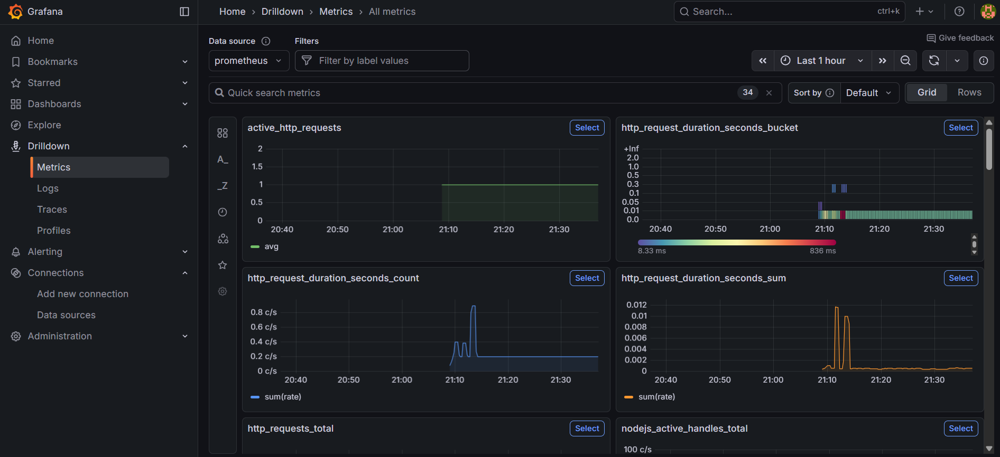

# Prometheus & Grafana Monitoring for Express.js

This project demonstrates a complete monitoring stack for an Express.js application using **Prometheus** for metrics collection and **Grafana** for visualization.

## 🚀 Quick Start

1.  **Start the services**:
    ```bash
    docker-compose up --build
    ```

2.  **Access the services**:
    *   **Express App**: [http://localhost:3000](http://localhost:3000)
    *   **Prometheus**: [http://localhost:9090](http://localhost:9090)
    *   **Grafana**: [http://localhost:3001](http://localhost:3001)

## 📊 Prometheus Queries (PromQL)

Here are the essential PromQL queries to monitor your application, categorized by their purpose.

### 🚦 Traffic Metrics

**1. Total Requests (Counter)**
*   Shows **requests per second** over the last 1 minute.
*   `sum` combines all routes, methods, and statuses.
```promql
sum(rate(http_requests_total[1m]))
```

**2. Requests per Route**
*   Shows request rate **grouped by route**.
*   Useful to identify the most used endpoints.
```promql
sum by (route) (rate(http_requests_total[1m]))
```

**3. Requests per Method**
*   Compare usage of different HTTP methods (GET, POST, etc.).
```promql
sum by (method) (rate(http_requests_total[1m]))
```

**4. Requests per Status Code**
*   Shows number of requests **per status code** (200, 404, 500).
*   Essential for monitoring error spikes.
```promql
sum by (status) (rate(http_requests_total[1m]))
```

### ⏱️ Latency Metrics

**5. Average Request Duration**
*   Calculates the **average latency in seconds**.
```promql
sum(rate(http_request_duration_seconds_sum[1m])) / 
sum(rate(http_request_duration_seconds_count[1m]))
```

**6. Request Latency Percentiles (Histogram)**
*   **P50 (Median)**:
    ```promql
    histogram_quantile(0.50, sum(rate(http_request_duration_seconds_bucket[1m])) by (le))
    ```
*   **P90 (90th Percentile)**:
    ```promql
    histogram_quantile(0.90, sum(rate(http_request_duration_seconds_bucket[1m])) by (le))
    ```
*   *Note: Change `0.90` to `0.95` or `0.99` for P95/P99.*

**7. Slow Requests (>500ms)**
*   Count of requests **under 500ms**. Subtract from total to find slow requests.
```promql
sum(rate(http_request_duration_seconds_bucket{le="0.5"}[1m]))
```

### ⚠️ System & Error Metrics

**8. Error Rate (% of 5xx requests)**
*   Shows the proportion of requests resulting in **server errors**.
```promql
sum by (status)(rate(http_requests_total{status=~"5.."}[1m])) / sum(rate(http_requests_total[1m]))
```

**9. Active Requests (Gauge)**
*   Current number of requests being processed.
```promql
active_http_requests
```

### 📈 Dashboarding

**10. Requests over time (Smoothed)**
*   Shows a **smoothed request rate** over 5 minutes, ideal for Grafana dashboards.
```promql
rate(http_requests_total[5m])
```

## 📸 Screenshots


*Grafana Dashboard visualizing the metrics*


*Prometheus Graph View*
